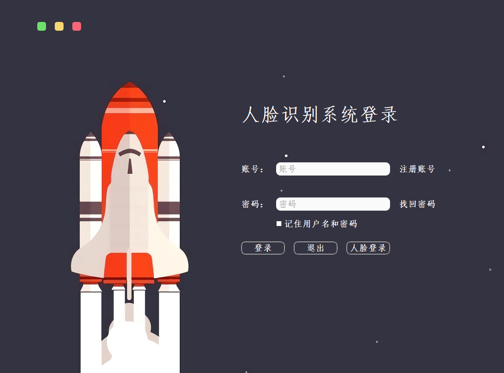
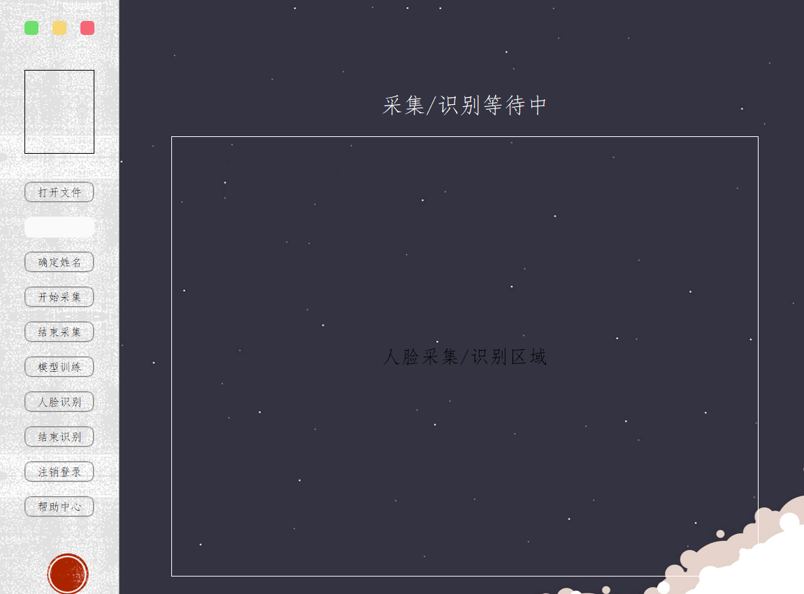

# 基于Keras框架的CNN人脸识别系统设计

注：两种启动方式，对应两种界面切换方式。第一种通过运行run.py启动程序（通过pyqtSignal方式进行界面切换），第二种运行login_main.py启动程序（通过循环隐藏界面进行切换，程序无bug，但方式不太合理）

## 一、登录界面

### 1、登录

密码登录，需输入正确的账户和密码，其中预置账户密码于login_info文件夹中，正确输入则进入主界面。内置三个账号，分别是：admin:admin;tuzhiyong:tuzhiyong;user:user

### 2、退出

退出系统

### 3、人脸登录

根据主界面中采集及训练的人脸特征模型进行人脸识别，若识别出的人脸包含在人脸数据库中，则进入主界面。其中已预置CASIA人脸库中的部分人脸数据和包含本人人脸训练得到的示例模型。

## 二、主界面

## 1.打开文件

请先打开人脸识别名单及照片文件夹：user_info，该文件夹需用户提前准备好，名称随意，但文件夹需包含image文件夹和information.xls。其中information.xls包含无列名的两列，第一列为账户昵称，第二列为账户ID；image文件夹包含与账户ID一一对应的头像图片。程序已预置了一个user_info文件夹示例

## 2.确定姓名

确定采集人姓名，在data文件夹中生成对应账户ID的人脸存储文件夹，每类人脸的文件夹名称即为对应账户ID。程序已预置了一个data文件夹示例

## 3.开始采集

打开摄像头，使用OpenCV自动检测并裁剪人脸图片，并保存至对应文件夹，作为人脸数据库，单次最多处理200张图像

## 4.结束采集

关闭摄像头，清空缓存

## 5.模型训练

将采集的人脸数据导入CNN中进行特征提取，训练模型得到face.model和contrast_table文件，并存入need文件夹中。程序已预置了一个need文件夹示例。注意：CPU版程序训练时间约1400s，GPU版程序训练时间约200s。

## 6.人脸识别

打开摄像头，自动检测和识别人脸，单次最多连续识别1000张图像

## 7.结束识别

关闭摄像头，清空缓存

## 8.注销登录

注销并返回登录界面

## 9.帮助中心

精简的说明文件

